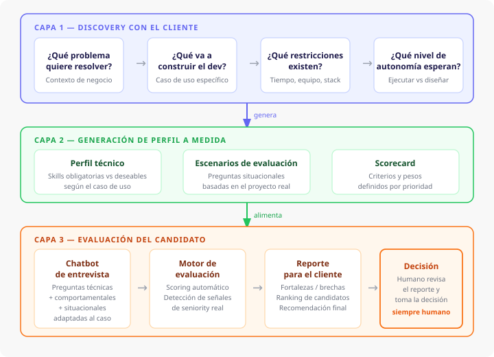

# Plataforma de Hiring Inteligente

> Una plataforma que entiende lo que el cliente necesita y evalúa candidatos a la medida — de forma automática, sin perder el criterio humano.

---

## Mapa general del sistema



El sistema tiene **3 capas** que trabajan en cadena:

| Capa | Qué hace |
|------|----------|
| **1. Discovery(Descubrimiento)** | Entiende qué necesita el cliente |
| **2. Perfil** | Construye el perfil ideal del candidato |
| **3. Evaluación** | Entrevista y califica a los candidatos |

---

## Capa 1 — Discovery con el cliente

### ¿Por qué un chatbot y no un formulario?

Imagina que le preguntas a alguien en qué ciudad vive con un formulario vs. una conversación:

```
Formulario:          vs.    Chatbot:
[ Ciudad: _______]          "¿Dónde vivís?"
                            → "En Buenos Aires, pero me mudo en 3 meses"
                            ← El formulario jamás hubiera sabido eso.
```

Los clientes **no siempre saben exactamente lo que necesitan**. Un formulario estático no puede hacer seguimiento. Un chatbot sí.

**Ejemplo real:**
> *"Mencionaste que querés mejorar el call center — ¿ya tenés definido cómo deben fluir las conversaciones, o eso también lo definiría el dev?"*

Esa pregunta no cabe en un formulario, pero es **crítica** para saber qué tan senior necesitás al candidato.

---

### Los 4 bloques del discovery

```
┌─────────────────────────────────────────────────────────────┐
│                    CHATBOT DE DISCOVERY                      │
│                                                              │
│  BLOQUE 1           BLOQUE 2           BLOQUE 3              │
│  El problema        El producto        El equipo             │
│  ─────────          ───────────        ─────────             │
│  • ¿Qué duele       • ¿Desde cero      • ¿Con quién          │
│    hoy?               o hay base?        trabaja?            │
│  • ¿Qué métrica     • ¿Qué             • ¿Quién decide       │
│    quieren            integraciones?     lo técnico?         │
│    mover?           • ¿Qué tan         • ¿Qué tan            │
│  • ¿Qué pasa si       crítico es en      maduro es           │
│    no lo              producción?        el equipo?          │
│    resuelven?                                                 │
│                                                              │
│                     BLOQUE 4                                 │
│                     Las restricciones reales                 │
│                     ─────────────────────────                │
│                     • Tiempo disponible                      │
│                     • Presupuesto                            │
│                     • Stack obligatorio                      │
│                     • Compliance o restricciones legales     │
└─────────────────────────────────────────────────────────────┘
```

---

### El output del discovery

No es un documento de Word. Es un **JSON estructurado** que el sistema lee solo:

```json
{
  "problema_negocio": "Mejorar tasa de resolución en call center",
  "metrica_objetivo": "Reducir AHT de 8 min a 5 min",
  "producto": "Chatbot conversacional con integración CRM",
  "desde_cero": false,
  "integraciones": ["Salesforce", "Twilio"],
  "critico_en_produccion": true,
  "equipo": { "toma_decision_tecnica": "CTO", "madurez": "media" },
  "restricciones": {
    "tiempo_semanas": 12,
    "stack_obligatorio": ["Python", "AWS"],
    "compliance": "SOC2"
  }
}
```

Esto alimenta **directamente** la Capa 2 y la Capa 3. No hay intermediario humano interpretando lo que dijo el cliente.

---

## Capa 2 — Generación del perfil a medida

Con el JSON del discovery, el sistema genera automáticamente:

```
Discovery JSON
      │
      ▼
┌─────────────┐    ┌────────────────────┐    ┌─────────────────┐
│   Perfil    │    │   Escenarios de    │    │   Scorecard     │
│   técnico   │    │   evaluación       │    │   con pesos     │
│─────────────│    │────────────────────│    │─────────────────│
│ Skills que  │    │ Preguntas basadas  │    │ Criterio A: 40% │
│ SÍ o SÍ     │    │ en el proyecto     │    │ Criterio B: 30% │
│ necesita    │    │ real del cliente   │    │ Criterio C: 30% │
│             │    │                    │    │                 │
│ Skills que  │    │ No son genéricas   │    │ Definidos por   │
│ sería lindo │    │ son del contexto   │    │ prioridad del   │
│ tener       │    │ específico         │    │ cliente         │
└─────────────┘    └────────────────────┘    └─────────────────┘
```

---

## Capa 3 — Evaluación del candidato

```
Candidato entra
      │
      ▼
┌──────────────────┐
│  Chatbot de      │  ← Preguntas técnicas + comportamentales
│  entrevista      │    + situacionales, todas del caso real
└────────┬─────────┘
         │
         ▼
┌──────────────────┐
│  Motor de        │  ← Scoring automático
│  evaluación      │    Detecta señales de seniority real
└────────┬─────────┘
         │
         ▼
┌──────────────────┐
│  Reporte para    │  ← Fortalezas y brechas
│  el cliente      │    Ranking de candidatos
└────────┬─────────┘    Recomendación final
         │
         ▼
┌──────────────────┐
│  DECISION        │  ← Siempre la toma un humano
│  HUMANA          │    El sistema informa, no decide
└──────────────────┘
```

> **Importante:** La IA evalúa y rankea. La decisión final siempre la toma una persona. El sistema informa; no reemplaza el criterio humano.

---

## Flujo completo en una línea

```
Cliente habla → Sistema entiende → Perfil se genera → Candidato se evalúa → Humano decide
```

---

## Resumen para contarle a alguien

Imagina que querés contratar a alguien para arreglar tu auto, pero no sabés exactamente qué tiene:

1. **Discovery:** El mecánico te hace preguntas inteligentes para entender qué falla de verdad
2. **Perfil:** Con eso arma la lista de herramientas y habilidades que necesita quien lo arregle
3. **Evaluación:** Le hace un examen práctico específico para ese problema, no uno genérico
4. **Decisión:** Vos leés el informe y decidís a quién contratar

Eso es exactamente lo que hace esta plataforma, pero para devs.
